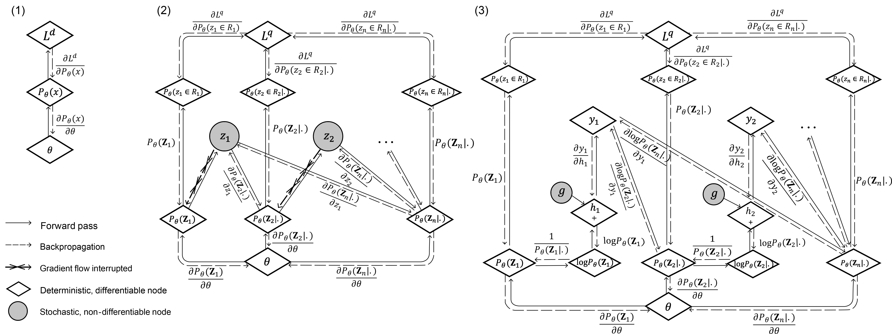

## [A Unified Deep Model of Learning from both Data and Queries for Cardinality Estimation ](https://arxiv.org/pdf/2107.12295)
### Introduction
This repo contains the source code for the SIGMOD 2021 paper, [UAE](https://arxiv.org/pdf/2107.12295).

UAE's high-level idea is learning a single model from both data and queires.

The key detailed technical contribution of UAE is **Differentiable Progressive Sampling (DPS)**, which enables (deep) autoregressive models to learn the underlying data distribution from queries. This idea is also new in machine learning literature.

<p align="center">
    <br>
    
<p>

### Main Directories
[`./UAE_single_table`](./UAE_single_table): the code for the single-table version of UAE/UAE-Q

[`./UAE_joins`](./UAE_joins): the code for the join version of UAE/UAE-Q

[`./PostgreSQL_modified`](./PostgreSQL_modified): the code for the modified version of PostgreSQL 9.6.6 with a Python interface, which accepts injected cardinality estimates. 

### Notes
* The work was funded by SingTel and the IP is owned jointly by both NTU and SingTel.

* We have release the single table version of UAE/UAE-Q in [`./UAE_single_table`](./UAE_single_table). We are still pending the clearance from SingTel before we can release the join version of UAE/UAE-Q and the modified PostgreSQL (will be soon) to the public. 

* Note that the core code for implementing UAE (i.e., DPS) is similar in single-table and join versions of UAE.

* We currently implement UAE with MADE and ResMADE autoregressive architectures. Interested readers can implement UAE with other autoregressive models (e.g., Transformer).

If you have any questions or have better implementations of UAE, please drop me an email at [peizhi.wu@ntu.edu.sg](mailto:peizhi.wu@ntu.edu.sg) (will be disabled soon) or at [pagewu@seas.upenn.edu](mailto:pagewu@seas.upenn.edu).

### Citation
If you find this work helpful to your research, please consider citing:
```bibtex
@inproceedings{wu2021unified,
  title={A Unified Deep Model of Learning from both Data and Queries for Cardinality Estimation},
  author={Wu, Peizhi and Cong, Gao},
  booktitle={Proceedings of the 2021 International Conference on Management of Data},
  pages={2009--2022},
  year={2021}
}
```

### Acknowledgment

* This single-table and join versions of UAE are based on [Naru](https://github.com/naru-project/naru) and [NeuroCard](https://github.com/neurocard/neurocard), repectively. Thanks to the contributors of Naru and Neurocard.
* The modified PostgreSQL is based on the [Pessimistic Cardinality Estimation](https://github.com/waltercai/pqo-opensource) project. Thanks to the authors.


